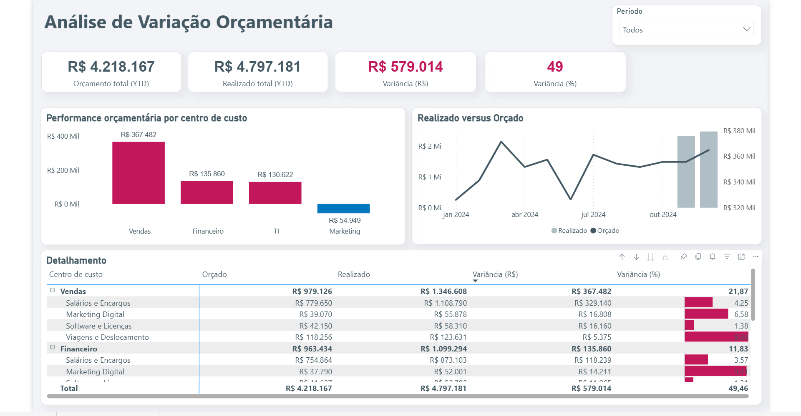

# Análise de Variância Orçamentária (Orçado vs. Realizado)

Projeto de Business Intelligence que simula uma análise financeira e orçamentária identificando os principais desvios (variâncias) por Centro de Custo e Conta Contábil.

## 🎯 Objetivo

Comparar os valores orçados com os gastos reais de uma empresa fictícia, identificando os principais desvios (variâncias) por Centro de Custo e Conta Contábil.

## 🛠️ Arquitetura do Projeto (ELT)

1.  **Extração (Python):** Os scripts ("gerar_orcamento.py", "gerar_realizado.py") usam Pandas e Faker para criar um dataset.
2.  **Carga (Python):** O script ("etl_carga_dados_analise_financeira_orcamentaria.py") usa SQLAlchemy e Psycopg2 para carregar os CSVs no Supabase.
3.  **Transformação (SQL):** A VIEW ("v_analise_financeira_orcamentaria") é criada agrega os dados transacionais e calcula as variâncias (absoluta e Percentuaa) em servidor.
4.  **Visualização (Power BI):** O dashboard se conecta a um **Dataflow** do Power BI, que consome a VIEW, garantindo performance e escalabilidade.

## 📊 Dashboard Interativo

## 📜 Print da tela do Dashboard

## 🔗 Link do Dashboard Interativo
([Demo Dashboard Financeiro](https://youtu.be/M5WMPgp4BPY))

## 🔧 Ferramentas Utilizadas

* **Linguagens:** Python (Pandas, Faker, SQLAlchemy, Psycopg2) e SQL (PostgreSQL)
* **Banco de Dados:** Supabase
* **BI:** Power BI Desktop & Power BI Service (Dataflows)

---
*Desenvolvido por Andressa*
